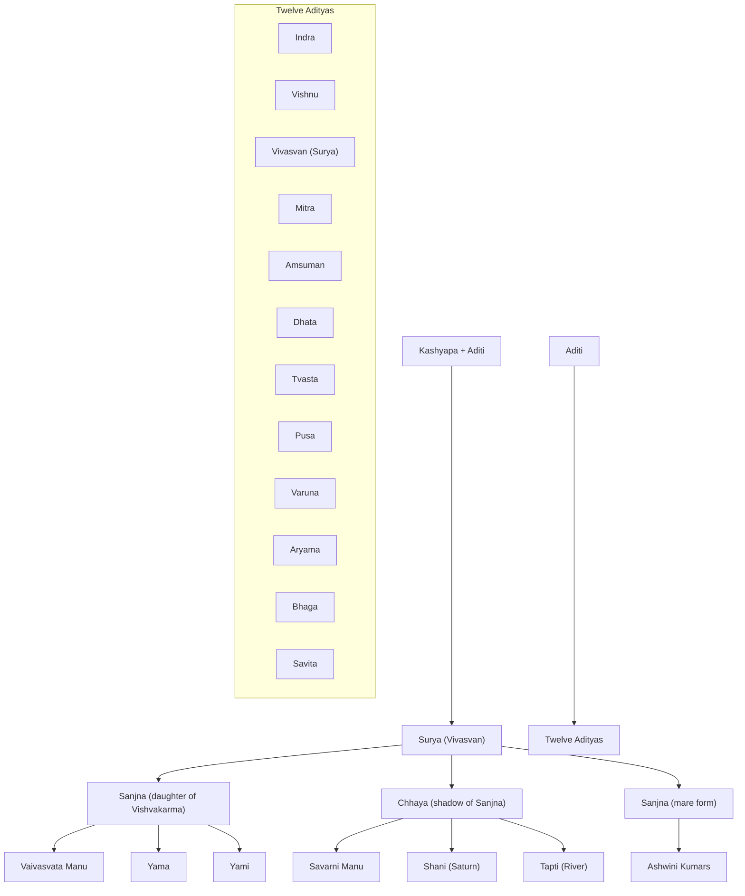

- Light, aatma, ram, name and fame
- Nature: Satvik, Kroor
- Metal - Gold, Copper
- Direction - East
- Karaka of: 
	- Leadership 
	- Father
	- Vision 
	- Drishti
	- Govt
	- Technical
	- Paternal Relations
	- High Officials
	- Govt works
	- Govt jobs
	- Bureaucrats
	- Bones in body
	- Confidence
	- Father Figures
	- Overall health
	- Dharma
	- Outside Home()
	- Dance - Natraj
- Positive Qualities : Dominant, atma-samman, Authoritative, strong, fatherly, leadership, Visionary, growth, gain power and influence
- Negative Qualities: arrogance, egoistic
- Sthir, stationary, motion of 1 degree
- Color: Bright red
- Drishti - 7th
	- Sun looks at everyone in 1 way
- To understand sun , understand lord ram or your father figures in life. 
- Some observations
	- Talk less
	- Authoritative
	- Fearful
	- Maintain distance
	- Reserved
	- Apne hit ko chodkar parivar ka hit rakhta hai. 
	- Harsh in action and speech
	- Caring
- Industries/Professions
	- Health
	- Governance
	- Jyotish
	- Spirituality
- Surya kisi bhi raashi main ghuste hi result dete hain
- 
### Mythological Importance
- Where sun is called Surya Lok next to bhu loka where humans live
- Responsible for life and energy 
- Rishi Kashyap + Wife Aditi
	- Gave birth to 12 adityas
- Ditti gave birth to Asurs
- Ashwani Kumars
	- first doctors
- Sun divided his light into 16 parts
- Arun is charioteer of sun
- 7 horses as rays of vibgyor
	- Gayatri
	- Brhati
	- Usnik
	- Jagati
	- Tristup
	- Anustup
	- Pankti
- 
Kashyapa + Aditi  
└── Surya (Vivasvan) – One of the 12 Adityas  
    ├── Wife: Sanjna (daughter of Vishvakarma)  
    │   ├── Vaivasvata Manu  
    │   ├── Yama (God of Death)  
    │   └── Yami (River Yamuna)  
    ├── Wife: Chhaya (Shadow of Sanjna)  
    │   ├── Savarni Manu  
    │   ├── Shani (Planet Saturn)  
    │   └── Tapti (River Goddess)  
    └── Sanjna (as Mare form)  
        └── Ashwini Kumaras (twin celestial physicians)  

Twelve Adityas (Sons of Aditi):  
- Indra  
- Vishnu  
- Vivasvan (Surya)  
- Mitra  
- Amsuman  
- Dhata  
- Tvasta  
- Pusa  
- Varuna  
- Aryama  
- Bhaga  
- Savita (chosen for sole worship by Brahma)

