# Sun (Surya) 🌞

## Basic Information

- **Sanskrit Name**: Surya, Ravi
- **Nature**: Masculine, Sattvic, Kroor (Cruel when afflicted)
- **Element**: Fire (Agni)
- **Direction**: East
- **Metal**: Gold, Copper
- **Color**: Bright Red
- **Gemstone**: Ruby (Manikya)
- **Age**: 22 years
- **Day**: Sunday (Ravivar)
- **Gender**: Male
- **Varna**: Kshatriya (Warrior)

## Planetary Details

- **Exaltation**: <span className="hindi">मेष</span> (10°) - Param Uchcha
- **Debilitation**: <span className="hindi">तुला</span> (10°)
- **Moolatrikona**: <span className="hindi">सिंह</span> (0° - 20°)
- **Own Sign**: <span className="hindi">सिंह</span>
- **Friends**: <span className="hindi">चंद्र</span>, <span className="hindi">मंगल</span>, <span className="hindi">गुरु</span>
- **Enemies**: <span className="hindi">शुक्र</span>, <span className="hindi">शनि</span>
- **Neutral**: <span className="hindi">बुध</span>

## Dasha Period
6 years in Vimshottari Dasha

## Drishti (Aspect)
- **7th House** - Full aspect
- Sun looks at everyone in one way

## Significations (Karaka)

### Personal
- **Atma** (Soul)
- Father
- Leadership
- Vision and Drishti
- Confidence
- Self-respect (Atma-samman)
- Father figures
- Overall health
- Dharma
- Dance (Natraj)

### Professional
- Government and authority
- High officials
- Bureaucrats
- Government jobs and works
- Technical fields
- Health industry
- Governance
- Jyotish (Astrology)
- Spirituality

### Physical
- Bones in body
- Right eye (for males)
- Heart
- Stomach

## Qualities

### Positive Traits
- Dominant
- Authoritative
- Strong
- Fatherly
- Leadership
- Visionary
- Growth-oriented
- Gains power and influence
- <span className="hindi">अपने हित को छोड़कर परिवार का हित रखता है</span> (Puts family interest above self)

### Negative Traits
- Arrogance
- Egoistic

## Behavioral Observations

- Talk less
- Authoritative
- Fearful presence
- Maintains distance
- Reserved
- Harsh in action and speech
- Caring

## Special Characteristics

- Sthir (Stationary), motion of 1 degree per day
- <span className="hindi">सूर्य किसी भी राशि में घुसते ही रिजल्ट देते हैं</span> (Sun gives results immediately upon entering any sign)
- To understand Sun, understand Lord Ram or your father figures in life
- Never retrograde

## Debilitation Effects

- <span className="hindi">नीच का सूर्य</span> (Neech ka Surya) - Confidence is less

## Mythological Importance

### Lineage
**Rishi Kashyap + Wife Aditi**
- Gave birth to 12 Adityas
- Surya is one of the 12 Adityas
- Surya Lok exists next to Bhu Loka where humans live

**Twelve Adityas (Sons of Aditi):**
1. Indra
2. Vishnu
3. Vivasvan (Surya)
4. Mitra
5. Amsuman
6. Dhata
7. Tvasta
8. Pusa
9. Varuna
10. Aryama
11. Bhaga
12. Savita (chosen for sole worship by Brahma)

### Sun's Family Tree

```mermaid
graph TD
    Kashyapa["Kashyapa + Aditi"]
    Surya["Surya (Vivasvan)"]
    
    Kashyapa --> Surya
    
    Sanjna["Sanjna (daughter of Vishvakarma)"]
    Chhaya["Chhaya (shadow of Sanjna)"]
    Mare["Sanjna (mare form)"]
    
    Surya --> Sanjna
    Surya --> Chhaya
    Surya --> Mare
    
    Sanjna --> Manu1["Vaivasvata Manu"]
    Sanjna --> Yama["Yama (God of Death)"]
    Sanjna --> Yami["Yami (River Yamuna)"]
    
    Chhaya --> Savarni["Savarni Manu"]
    Chhaya --> Shani["Shani (Saturn)"]
    Chhaya --> Tapti["Tapti (River Goddess)"]
    
    Mare --> Ashwini["Ashwini Kumaras (Twin Physicians)"]
    
    Kashyapa --> Adityas["Twelve Adityas"]
    
    style Surya fill:#ff9900,stroke:#ff6600,stroke-width:3px
    style Shani fill:#4a4a4a,stroke:#000,stroke-width:2px
    style Ashwini fill:#90EE90,stroke:#228B22,stroke-width:2px
```



**Surya (Vivasvan)** had three consorts:

**1. Sanjna (daughter of Vishvakarma)**
- Vaivasvata Manu
- Yama (God of Death)
- Yami (River Yamuna)

**2. Chhaya (Shadow of Sanjna)**
- Savarni Manu
- Shani (Planet Saturn)
- Tapti (River Goddess)

**3. Sanjna (as Mare form)**
- Ashwini Kumaras (twin celestial physicians - first doctors)

### Solar Chariot

**Sun divided his light into 16 parts**

**Charioteer**: Arun (brother of Garuda)

**Seven Horses** (representing rays of VIBGYOR):
1. Gayatri
2. Brhati
3. Usnik
4. Jagati
5. Tristup
6. Anustup
7. Pankti

## Connection to Rishi Kashyap

- **Ditti** (another wife of Kashyap) gave birth to Asuras
- Shows the duality in creation - Adityas (divine) and Asuras (demonic)

## Mantra

**Gayatri Mantra for Sun**:
```
Om Bhaskaraya Vidmahe
Divakaraya Dhimahi
Tanno Suryah Prachodayat
```

**Beej Mantra**:
```
Om Hraam Hreem Hraum Sah Suryaya Namah
```

## Remedies for Strengthening Sun

- Wake up early and watch sunrise
- Offer water to Sun at sunrise
- Practice Surya Namaskar (Sun Salutation)
- Wear ruby gemstone (after consultation)
- Donate wheat, jaggery, or copper on Sundays

---

**Related Pages:**
- [Planetary States](/grahas/concepts/planetary-states) - Exaltation and debilitation
- [Drishti](/grahas/concepts/drishti) - Understanding planetary aspects
